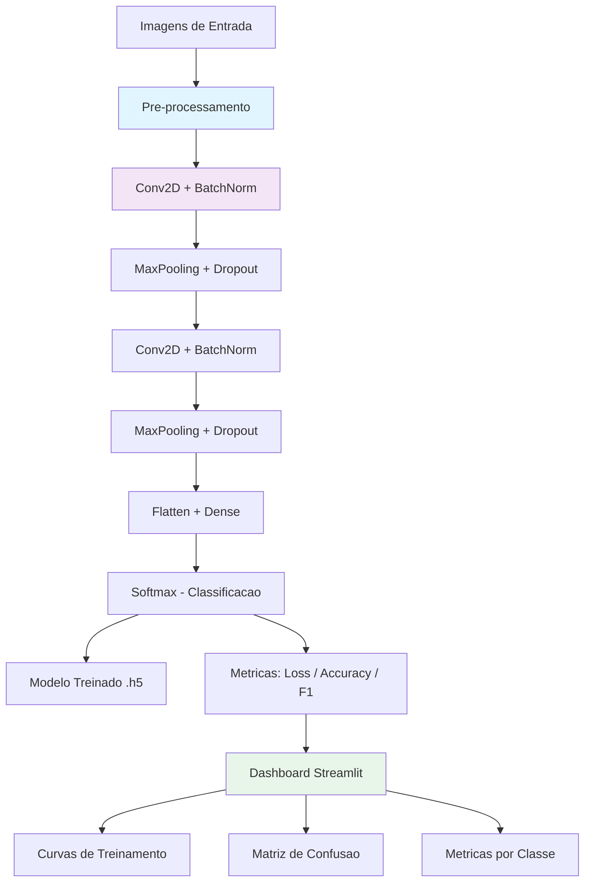
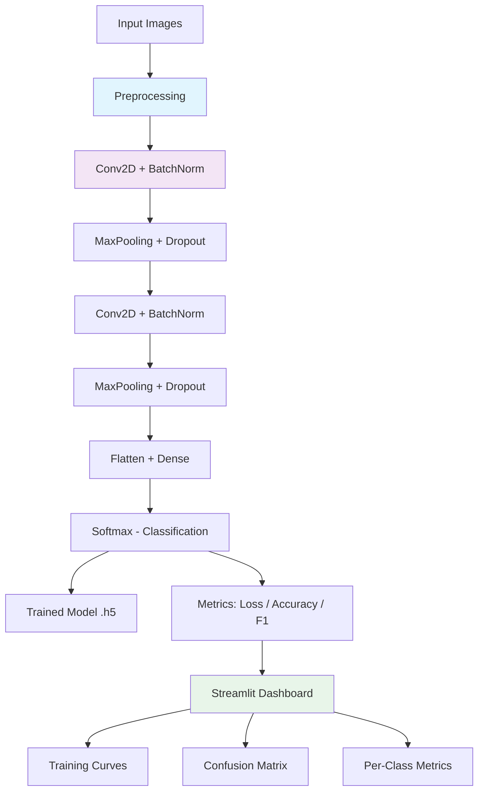

<div align="center">

# IBM Deep Learning Capstone

[](https://python.org)
[](https://www.tensorflow.org/)
[](https://streamlit.io/)
[](https://plotly.com/)
[](Dockerfile)
[](LICENSE)

Projeto capstone do certificado profissional IBM Deep Learning -- plataforma CNN para classificacao de imagens com dashboard Streamlit interativo para visualizacao de metricas de treinamento.

Capstone project from the IBM Deep Learning Professional Certificate -- CNN platform for image classification with an interactive Streamlit dashboard for training metrics visualization.

[Portugues](#portugues) | [English](#english)

</div>

---

<a name="portugues"></a>
## Portugues

### Sobre

Este projeto foi desenvolvido como capstone da certificacao profissional IBM Deep Learning. A plataforma permite construir, treinar e avaliar redes neurais convolucionais (CNNs) para classificacao de imagens utilizando TensorFlow/Keras. O modelo inclui blocos de Conv2D com BatchNormalization e Dropout para regularizacao, alem de callbacks como EarlyStopping e ReduceLROnPlateau. Um dashboard interativo em Streamlit permite visualizar curvas de loss e acuracia, matriz de confusao e metricas por classe (precision, recall, F1-score) em tempo real. O projeto exercita conceitos fundamentais de redes profundas aplicadas a visao computacional.

### Tecnologias

| Tecnologia | Descricao |
|---|---|
| Python 3.12 | Linguagem principal |
| TensorFlow / Keras | Framework de deep learning (CNN) |
| Streamlit | Dashboard interativo |
| Plotly | Visualizacoes interativas (curvas, heatmaps) |
| NumPy / Pandas | Manipulacao de dados e arrays |
| scikit-learn | Metricas de avaliacao |
| Matplotlib / Seaborn | Visualizacoes auxiliares |

### Arquitetura



### Estrutura do Projeto

```
ibm-deep-learning-capstone/
├── src/
│   ├── deep_learning_platform.py   # Plataforma CNN (modelo, treino, avaliacao)
│   └── main_platform.py            # Dashboard Streamlit
├── tests/
│   ├── __init__.py
│   ├── performance_test.py
│   └── test_platform.py
├── docs/
│   ├── api_documentation.md
│   └── user_guide.md
├── Dockerfile
├── requirements.txt
├── LICENSE
└── README.md
```

### Inicio Rapido

```bash
# Clonar o repositorio
git clone https://github.com/galafis/ibm-deep-learning-capstone.git
cd ibm-deep-learning-capstone

# Criar ambiente virtual
python -m venv venv
source venv/bin/activate  # Windows: venv\Scripts\activate

# Instalar dependencias
pip install -r requirements.txt

# Executar dashboard
streamlit run src/main_platform.py

# Criar e treinar modelo CNN
python src/deep_learning_platform.py
```

### Docker

```bash
docker build -t ibm-deep-learning-capstone .
docker run -p 8000:8000 ibm-deep-learning-capstone
```

### Testes

```bash
pytest
pytest --cov --cov-report=html
pytest tests/test_platform.py -v
```

### Aprendizados

- Arquitetura de CNNs com blocos Conv2D, BatchNormalization, MaxPooling e Dropout
- Uso de callbacks (EarlyStopping, ReduceLROnPlateau) para controle de treinamento
- Avaliacao de modelos com matriz de confusao e metricas por classe (precision, recall, F1)
- Construcao de dashboards interativos com Streamlit e Plotly
- Persistencia de modelos treinados para reutilizacao

### Autor

**Gabriel Demetrios Lafis**
- GitHub: [@galafis](https://github.com/galafis)
- LinkedIn: [Gabriel Demetrios Lafis](https://linkedin.com/in/gabriel-demetrios-lafis)

### Licenca

Este projeto esta licenciado sob a [Licenca MIT](LICENSE).

---

<a name="english"></a>
## English

### About

This project was developed as a capstone for the IBM Deep Learning Professional Certificate. The platform enables building, training, and evaluating Convolutional Neural Networks (CNNs) for image classification using TensorFlow/Keras. The model includes Conv2D blocks with BatchNormalization and Dropout for regularization, along with callbacks such as EarlyStopping and ReduceLROnPlateau. An interactive Streamlit dashboard allows real-time visualization of loss and accuracy curves, confusion matrices, and per-class metrics (precision, recall, F1-score). The project exercises fundamental concepts of deep networks applied to computer vision.

### Technologies

| Technology | Description |
|---|---|
| Python 3.12 | Core language |
| TensorFlow / Keras | Deep learning framework (CNN) |
| Streamlit | Interactive dashboard |
| Plotly | Interactive visualizations (curves, heatmaps) |
| NumPy / Pandas | Data and array manipulation |
| scikit-learn | Evaluation metrics |
| Matplotlib / Seaborn | Auxiliary visualizations |

### Architecture



### Project Structure

```
ibm-deep-learning-capstone/
├── src/
│   ├── deep_learning_platform.py   # CNN platform (model, training, evaluation)
│   └── main_platform.py            # Streamlit dashboard
├── tests/
│   ├── __init__.py
│   ├── performance_test.py
│   └── test_platform.py
├── docs/
│   ├── api_documentation.md
│   └── user_guide.md
├── Dockerfile
├── requirements.txt
├── LICENSE
└── README.md
```

### Quick Start

```bash
# Clone the repository
git clone https://github.com/galafis/ibm-deep-learning-capstone.git
cd ibm-deep-learning-capstone

# Create virtual environment
python -m venv venv
source venv/bin/activate  # Windows: venv\Scripts\activate

# Install dependencies
pip install -r requirements.txt

# Run dashboard
streamlit run src/main_platform.py

# Build and train CNN model
python src/deep_learning_platform.py
```

### Docker

```bash
docker build -t ibm-deep-learning-capstone .
docker run -p 8000:8000 ibm-deep-learning-capstone
```

### Tests

```bash
pytest
pytest --cov --cov-report=html
pytest tests/test_platform.py -v
```

### Learnings

- CNN architecture with Conv2D, BatchNormalization, MaxPooling, and Dropout blocks
- Using callbacks (EarlyStopping, ReduceLROnPlateau) for training control
- Model evaluation with confusion matrix and per-class metrics (precision, recall, F1)
- Building interactive dashboards with Streamlit and Plotly
- Persisting trained models for reuse

### Author

**Gabriel Demetrios Lafis**
- GitHub: [@galafis](https://github.com/galafis)
- LinkedIn: [Gabriel Demetrios Lafis](https://linkedin.com/in/gabriel-demetrios-lafis)

### License

This project is licensed under the [MIT License](LICENSE).
