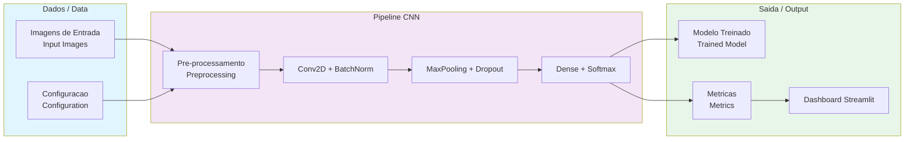

# IBM Deep Learning Capstone

Projeto capstone do certificado profissional IBM Deep Learning com TensorFlow e Keras. Inclui uma plataforma CNN para classificacao de imagens e um dashboard interativo com Streamlit para visualizacao de metricas de treinamento.

Capstone project from the IBM Deep Learning Professional Certificate with TensorFlow and Keras. Includes a CNN platform for image classification and an interactive Streamlit dashboard for training metrics visualization.

[](https://python.org)
[](https://www.tensorflow.org/)
[](https://streamlit.io/)
[](LICENSE)
[](Dockerfile)

**[PT-BR](#portugues)** | **[English](#english)**

---

## Arquitetura / Architecture



---

<a name="portugues"></a>
## PT-BR

### Visao Geral

Plataforma de deep learning desenvolvida como projeto capstone da certificacao IBM. O projeto demonstra construcao, treinamento e avaliacao de redes neurais convolucionais (CNNs) para classificacao de imagens, acompanhado de um dashboard interativo para analise de resultados.

### Funcionalidades

- **Plataforma CNN**: Construcao de modelos com Conv2D, BatchNormalization, Dropout e camadas Dense
- **Treinamento com callbacks**: Early stopping e reducao automatica de learning rate
- **Avaliacao de modelos**: Metricas de acuracia, loss, matriz de confusao e F1-score por classe
- **Dashboard Streamlit**: Visualizacao interativa das curvas de treinamento e resultados
- **Persistencia**: Salvar e carregar modelos treinados

### Inicio Rapido

```bash
git clone https://github.com/galafis/ibm-deep-learning-capstone.git
cd ibm-deep-learning-capstone

python -m venv venv
source venv/bin/activate  # Windows: venv\Scripts\activate

pip install -r requirements.txt

# Dashboard
streamlit run src/main_platform.py

# Criar modelo CNN
python src/deep_learning_platform.py
```

### Estrutura do Projeto

```
ibm-deep-learning-capstone/
├── src/
│   ├── deep_learning_platform.py   # Plataforma CNN (modelo, treino, avaliacao)
│   └── main_platform.py            # Dashboard Streamlit
├── tests/
│   ├── __init__.py
│   ├── performance_test.py
│   └── test_platform.py
├── docs/
│   ├── api_documentation.md
│   └── user_guide.md
├── requirements.txt
├── LICENSE
└── README.md
```

### Tecnologias

| Tecnologia | Descricao |
|---|---|
| Python 3.12 | Linguagem principal |
| TensorFlow/Keras | Framework de deep learning |
| Streamlit | Framework de dashboard |
| Plotly | Visualizacoes interativas |
| NumPy/Pandas | Manipulacao de dados |
| scikit-learn | Metricas de avaliacao |

---

<a name="english"></a>
## English

### Overview

Deep learning platform built as a capstone project for the IBM Professional Certificate. The project demonstrates building, training, and evaluating Convolutional Neural Networks (CNNs) for image classification, accompanied by an interactive dashboard for result analysis.

### Features

- **CNN Platform**: Model building with Conv2D, BatchNormalization, Dropout, and Dense layers
- **Training with callbacks**: Early stopping and automatic learning rate reduction
- **Model evaluation**: Accuracy, loss, confusion matrix, and per-class F1-score metrics
- **Streamlit Dashboard**: Interactive visualization of training curves and results
- **Persistence**: Save and load trained models

### Quick Start

```bash
git clone https://github.com/galafis/ibm-deep-learning-capstone.git
cd ibm-deep-learning-capstone

python -m venv venv
source venv/bin/activate  # Windows: venv\Scripts\activate

pip install -r requirements.txt

# Dashboard
streamlit run src/main_platform.py

# Create CNN model
python src/deep_learning_platform.py
```

### Project Structure

```
ibm-deep-learning-capstone/
├── src/
│   ├── deep_learning_platform.py   # CNN platform (model, training, evaluation)
│   └── main_platform.py            # Streamlit dashboard
├── tests/
│   ├── __init__.py
│   ├── performance_test.py
│   └── test_platform.py
├── docs/
│   ├── api_documentation.md
│   └── user_guide.md
├── requirements.txt
├── LICENSE
└── README.md
```

### Technologies

| Technology | Description |
|---|---|
| Python 3.12 | Core language |
| TensorFlow/Keras | Deep learning framework |
| Streamlit | Dashboard framework |
| Plotly | Interactive visualizations |
| NumPy/Pandas | Data manipulation |
| scikit-learn | Evaluation metrics |

---

## Licenca / License

MIT License - see [LICENSE](LICENSE) for details.

## Autor / Author

**Gabriel Demetrios Lafis** - [GitHub](https://github.com/galafis) | [LinkedIn](https://linkedin.com/in/gabriel-demetrios-lafis)
